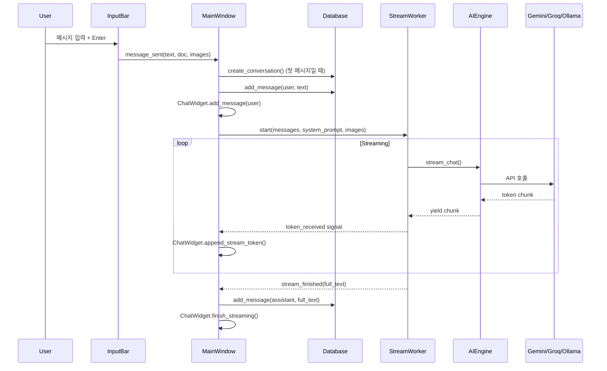
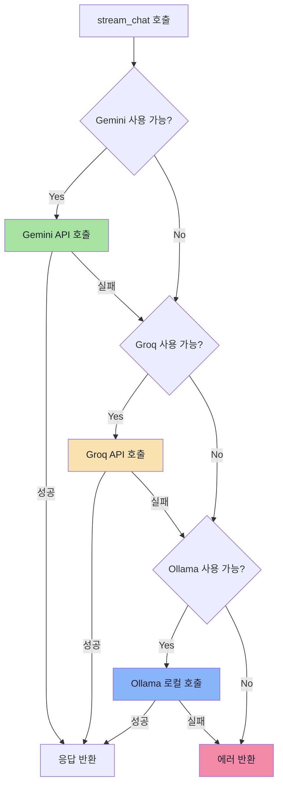
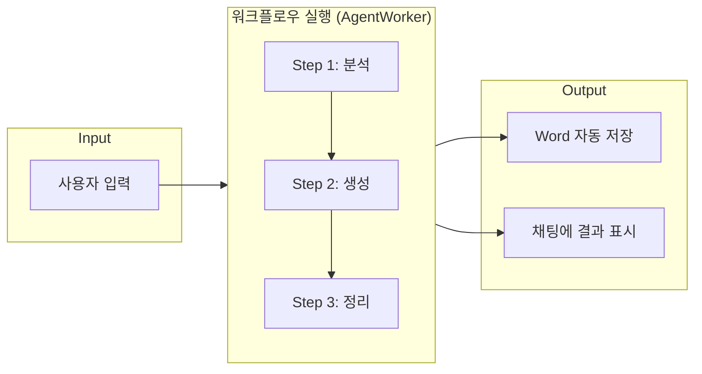
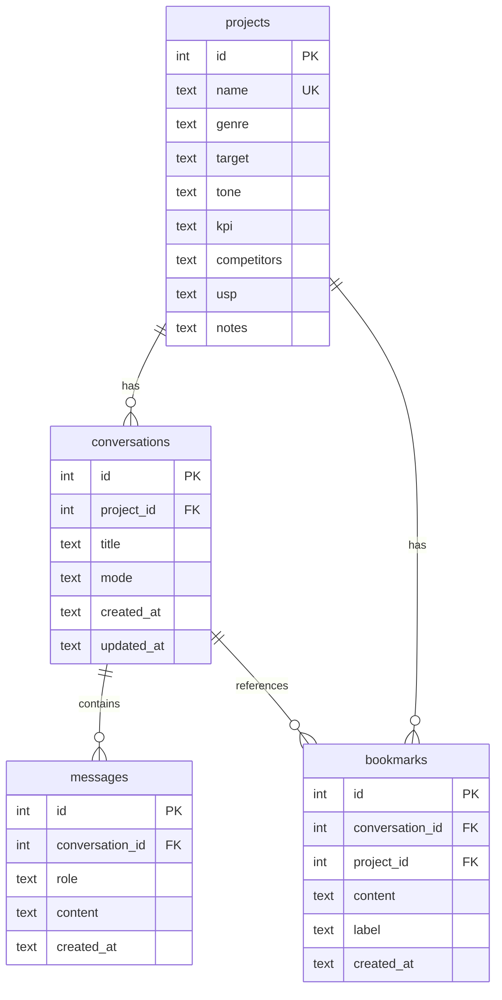
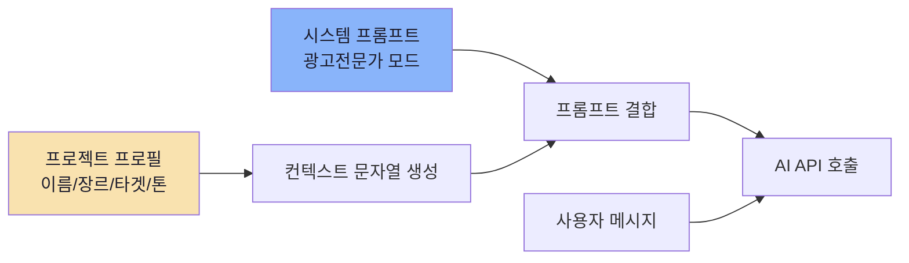

# 4Bro - Architecture & Flow

## System Architecture

```
┌─────────────────────────────────────────────────────────────────┐
│                        4Bro Desktop App                         │
│                         (PyQt6 GUI)                             │
├──────────┬──────────────────────────────────┬───────────────────┤
│ Sidebar  │          Chat Area               │    Top Bar        │
│          │                                  │                   │
│ Projects │  ┌────────────────────────┐      │ [Agent] [Export]  │
│ Convs    │  │   MessageBubble (user) │      │ [Mode]  [Settings]│
│ Recent   │  │   MessageBubble (ai)   │      │                   │
│          │  │   MessageBubble (...)   │      │                   │
│          │  └────────────────────────┘      │                   │
│          ├──────────────────────────────────┤                   │
│          │  [Attach] [Image] [Input] [Send] │                   │
├──────────┴──────────────────────────────────┴───────────────────┤
│ Status Bar: Engine | Usage | RAM                                │
└─────────────────────────────────────────────────────────────────┘
```

## Tech Stack

| Layer | Technology | Purpose |
|---|---|---|
| GUI Framework | PyQt6 | 데스크톱 UI (위젯, 이벤트, 스타일링) |
| Primary AI | Google Gemini API | 텍스트 생성, 이미지 분석, 이미지 생성 |
| Backup AI | Groq API | Gemini 한도 초과 시 자동 전환 |
| Local AI | Ollama | 오프라인 폴백 (선택) |
| Database | SQLite (WAL) | 대화, 프로젝트, 북마크 영구 저장 |
| Web Search | DuckDuckGo | API 키 없이 웹 검색 |
| Document I/O | python-docx, PyPDF2 | Word/PDF 읽기, Word 내보내기 |
| Theme | Catppuccin Mocha | 다크 테마 (#1e1e2e) |

## Directory Structure

```
4Bro/
├── src/
│   ├── main.py                 # Entry point
│   ├── app.py                  # Bootstrap (splash, init, launch)
│   │
│   ├── core/                   # Business logic (GUI 독립)
│   │   ├── api_client.py       # Gemini + Groq API 클라이언트
│   │   ├── engine.py           # 3-stage fallback 엔진 매니저
│   │   ├── worker.py           # QThread 스트리밍 워커
│   │   ├── agent.py            # 에이전트 워크플로우 정의 + 실행
│   │   ├── database.py         # SQLite CRUD
│   │   ├── prompts.py          # 시스템 프롬프트 (광고전문가/범용)
│   │   ├── media_specs.py      # 매체별 광고 규격 데이터
│   │   ├── web_search.py       # DuckDuckGo 웹 검색
│   │   ├── document_io.py      # PDF/Word 읽기, Word 저장
│   │   └── ollama_client.py    # 로컬 Ollama 래퍼
│   │
│   └── gui/                    # UI 컴포넌트
│       ├── main_window.py      # 메인 윈도우 (모든 기능 통합)
│       ├── chat_widget.py      # 채팅 영역 (메시지 버블, 스트리밍)
│       ├── input_bar.py        # 입력바 (텍스트, 파일/이미지 첨부)
│       ├── sidebar.py          # 사이드바 (프로젝트, 대화 목록)
│       ├── settings_dialog.py  # API 키 설정 다이얼로그
│       ├── project_dialog.py   # 프로젝트 프로필 CRUD
│       └── styles.py           # Catppuccin Mocha QSS 테마
│
├── docs/
│   └── 기획서_v2.0.md          # 상세 기획서
├── requirements.txt
├── build.spec                  # PyInstaller 빌드 설정
├── build.bat                   # exe 빌드 스크립트
└── setup.bat                   # 초기 설정 스크립트
```

## Core Flows

### 1. Chat Flow (일반 대화)



### 2. Engine Fallback (3단계 자동 전환)



### 3. Agent Workflow (에이전트 모드)



**5가지 워크플로우:**

| Workflow | Steps | 용도 |
|---|---|---|
| 매체별 일괄 변형 | 원본 확인 → 매체별 변형 → 최종 정리 | 하나의 카피를 GFA/GDN/SNS 등으로 변환 |
| 캠페인 패키지 | 타겟 분석 → 전략 → 카피 → SNS → 기획서 | 캠페인 기획 전체를 한번에 |
| 경쟁사 리서치 | 키워드 도출 → 정보 분석 → 차별화 전략 | 웹 검색 연동 경쟁사 분석 |
| 카피 대량 생성 | 방향 분석 → 대량 생성 → 분류 정리 | 헤드라인 50개 일괄 생성 |
| 보고서 자동화 | 데이터 분석 → 성과 요약 → 인사이트/제안 | 마케팅 보고서 자동 작성 |

### 4. Data Architecture



### 5. Project Context Injection



프로젝트를 선택한 상태에서 대화하면, 프로젝트 정보가 시스템 프롬프트에 자동 주입됩니다.
AI는 별도 지시 없이도 해당 프로젝트의 장르, 타겟, 톤앤매너를 반영하여 응답합니다.

## Threading Model

```
┌─────────────────┐     signals      ┌──────────────────┐
│   Main Thread    │ <──────────────> │  StreamWorker    │
│   (PyQt6 GUI)   │  token_received  │  (QThread)       │
│                  │  stream_finished │                  │
│  - UI 렌더링     │  stream_error    │  - API 호출       │
│  - 이벤트 처리   │                  │  - 스트리밍 수신   │
│  - DB 읽기/쓰기  │                  │                  │
└─────────────────┘                  └──────────────────┘
                     signals
                   <──────────────>  ┌──────────────────┐
                    step_started     │  AgentWorker     │
                    token_received   │  (QThread)       │
                    step_completed   │                  │
                    workflow_finished│  - 다단계 실행     │
                                    │  - 스텝별 스트리밍  │
                                    └──────────────────┘
```

- **Main Thread**: UI 렌더링과 사용자 이벤트만 처리 (블로킹 없음)
- **StreamWorker**: 단일 AI 요청을 백그라운드에서 스트리밍
- **AgentWorker**: 다단계 워크플로우를 순차 실행하며 각 스텝 스트리밍

모든 스레드 간 통신은 Qt의 Signal/Slot 메커니즘을 사용합니다.
이를 통해 스트리밍 응답이 실시간으로 UI에 반영되면서도 GUI가 멈추지 않습니다.

## Design Decisions

| 결정 | 이유 |
|---|---|
| Gemini > Groq > Ollama 폴백 | 비용 0원 유지하면서 안정성 확보. Gemini 무료 한도 초과 시 자동 전환 |
| SQLite WAL 모드 | 단일 사용자 데스크톱 앱에 적합. 읽기/쓰기 동시 가능, 설치 불필요 |
| QThread + Signal/Slot | PyQt 네이티브 스레딩. GIL과 무관하게 I/O 대기를 비동기 처리 |
| 프로젝트 컨텍스트 주입 | 매번 "묵혼온라인이라는 게임인데..." 반복 입력 불필요. 시스템 프롬프트에 자동 포함 |
| Catppuccin Mocha 테마 | 장시간 작업에 눈 피로도 낮은 다크 테마. 일관된 색상 시스템 |
| DuckDuckGo 검색 | API 키 불필요, 무료, 별도 설정 없이 바로 사용 가능 |
| Word 자동 저장 | 에이전트 결과물을 바로 보고서로 활용 가능. 광고업계 표준 포맷 |
| google-genai SDK | google-generativeai는 deprecated. 최신 공식 SDK 사용 |
